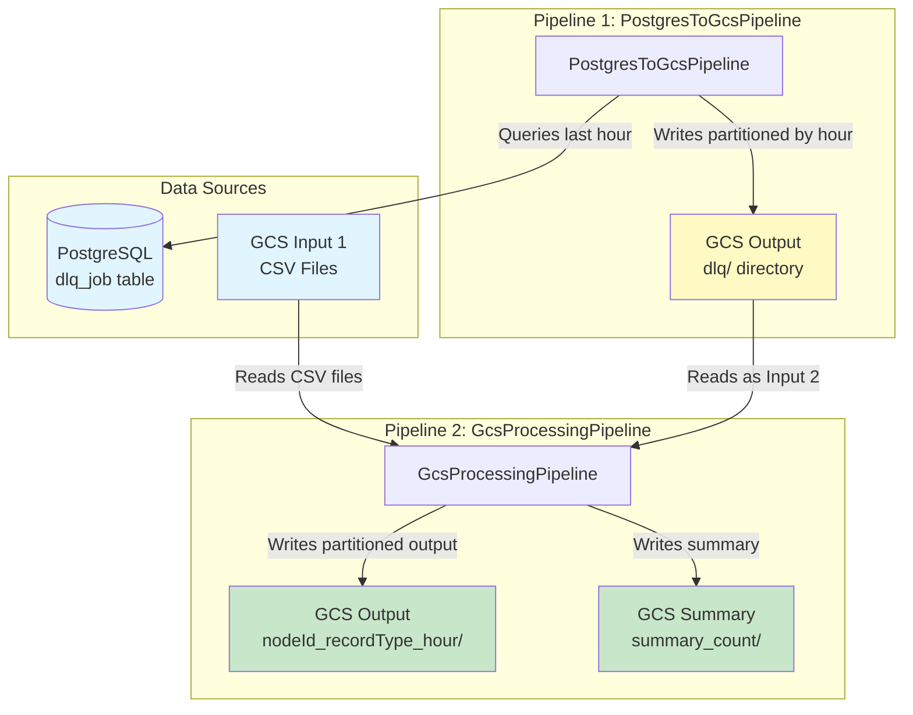
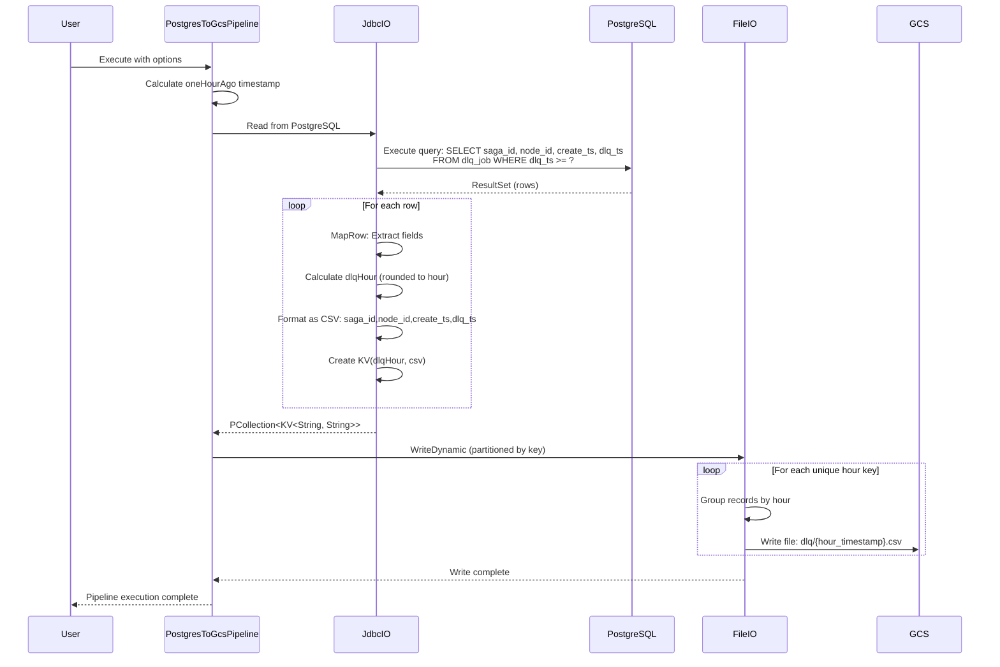
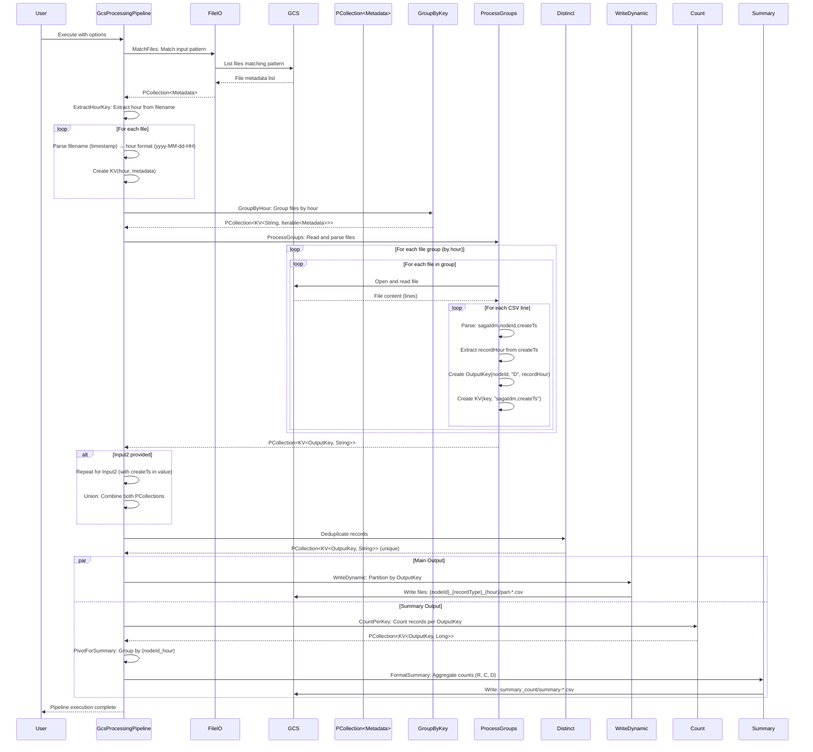

# Apache Beam Data Processing Pipelines

This project contains two Apache Beam pipelines for processing data from various sources and writing to Google Cloud Storage (GCS).

## Overview

The project includes two interconnected Apache Beam pipelines:

1. **PostgresToGcsPipeline** - Extracts data from PostgreSQL and writes to GCS. The output of this pipeline serves as Input 2 for the GcsProcessingPipeline.
2. **GcsProcessingPipeline** - Processes CSV files from GCS (two inputs), performs deduplication, and generates summary statistics. Input 1 comes from external GCS sources, while Input 2 comes from the PostgresToGcsPipeline output.

## Architecture

### High-Level Architecture Diagram



## Pipeline Details

### PostgresToGcsPipeline

Extracts data from a PostgreSQL database table (`dlq_job`) for records from the last hour and writes them to GCS partitioned by hour.

**Purpose**: Export recent DLQ (Dead Letter Queue) job records from PostgreSQL to GCS. The output of this pipeline serves as Input 2 for the GcsProcessingPipeline.

**Input Format**:
- Source: PostgreSQL `dlq_job` table
- Columns: `saga_id`, `node_id`, `create_ts`, `dlq_ts`
- Filter: Records where `dlq_ts >= (current_time - 1 hour)`

**Output Format**:
- Destination: GCS path specified by `--output` parameter
- File naming: `dlq/{hour_timestamp}.csv`
- CSV format: `saga_id,node_id,create_ts,dlq_ts`

#### Low-Level Sequence Diagram: PostgresToGcsPipeline



### GcsProcessingPipeline

Processes CSV files from GCS, extracts and transforms records, performs deduplication, and generates aggregated summaries.

**Purpose**: Process DLQ records from GCS files, deduplicate them, partition by node/type/hour, and generate summary statistics.

**Input Formats**:
1. **Input 1** (required): CSV files with format `sagaIdm,nodeId,createTs` - external GCS source
2. **Input 2** (optional): CSV files with format `sagaIdm,nodeId,createTs,dlqTs` - output from PostgresToGcsPipeline (dlq/ directory)

**Output Formats**:
1. **Main Output**: Partitioned CSV files with naming pattern `{nodeId}_{recordType}_{hour}/part-*.csv`
2. **Summary Output**: Aggregated counts file at `summary_count/summary-*.csv` with format `node_id,countR,countC,countD`

#### Processing Flow

1. **File Matching**: Matches files from GCS based on input patterns
2. **Hour Extraction**: Extracts hour from filename (timestamp-based)
3. **Grouping**: Groups files by hour for processing
4. **Parsing**: Reads and parses CSV records from files
5. **Key Generation**: Creates `OutputKey(nodeId, recordType="D", hour)` for each record
6. **Union**: Combines records from both inputs (if Input 2 is provided)
7. **Deduplication**: Removes duplicate records based on key and value
8. **Dynamic Write**: Writes deduplicated records partitioned by OutputKey
9. **Aggregation**: Counts records per key and generates summary statistics

#### Low-Level Sequence Diagram: GcsProcessingPipeline



## Configuration

### PostgresToGcsPipeline Options

| Option | Required | Description | Example |
|--------|----------|-------------|---------|
| `--postgresUrl` | Yes | PostgreSQL JDBC connection URL | `jdbc:postgresql://localhost:5432/dbname` |
| `--postgresUser` | Yes | PostgreSQL username | `myuser` |
| `--postgresPassword` | Yes | PostgreSQL password | `mypassword` |
| `--driverClass` | No | JDBC driver class (default: `org.postgresql.Driver`) | `org.postgresql.Driver` |
| `--output` | Yes | GCS output path prefix | `gs://bucket/path/to/output` |

### GcsProcessingPipeline Options

| Option | Required | Description | Example |
|--------|----------|-------------|---------|
| `--input` | Yes | GCS input file pattern | `gs://bucket/input/*.csv` |
| `--input2` | No | Second GCS input file pattern | `gs://bucket/input2/*.csv` |
| `--output` | Yes | GCS output directory | `gs://bucket/output` |

## Building the Project

```bash
mvn clean package
```

This will create a shaded JAR file in the `target/` directory with all dependencies included.

## Running the Pipelines

### PostgresToGcsPipeline

```bash
java -cp target/gcs-processing-pipeline-0.1.0-SNAPSHOT.jar \
  com.example.beam.PostgresToGcsPipeline \
  --postgresUrl=jdbc:postgresql://localhost:5432/mydb \
  --postgresUser=myuser \
  --postgresPassword=mypassword \
  --output=gs://my-bucket/output/prefix
```

### GcsProcessingPipeline

**With single input:**
```bash
java -cp target/gcs-processing-pipeline-0.1.0-SNAPSHOT.jar \
  com.example.beam.GcsProcessingPipeline \
  --input=gs://my-bucket/input/*.csv \
  --output=gs://my-bucket/output
```

**With two inputs:**
```bash
java -cp target/gcs-processing-pipeline-0.1.0-SNAPSHOT.jar \
  com.example.beam.GcsProcessingPipeline \
  --input=gs://my-bucket/input1/*.csv \
  --input2=gs://my-bucket/input2/*.csv \
  --output=gs://my-bucket/output
```

## Running on Dataflow

To run on Google Cloud Dataflow, add the runner option:

```bash
--runner=DataflowRunner \
--project=your-gcp-project \
--region=us-central1 \
--tempLocation=gs://your-bucket/temp
```

## Data Models

### OutputKey

The `OutputKey` class is used in `GcsProcessingPipeline` to partition output records:

- **nodeId**: Identifier for the node
- **recordType**: Type of record (e.g., "D" for DLQ records)
- **hour**: Hour identifier in format `yyyy-MM-dd-HH` (derived from timestamp)

Records are partitioned and written to files named: `{nodeId}_{recordType}_{hour}/part-*.csv`

## Testing

The project includes unit tests and integration tests for both pipelines:

```bash
mvn test
```

Test files:
- `GcsProcessingPipelineTest.java` - Unit tests
- `GcsProcessingPipelineIntegrationTest.java` - Integration tests
- `PostgresToGcsPipelineTest.java` - Unit tests
- `PostgresToGcsPipelineIntegrationTest.java` - Integration tests

## Dependencies

- Apache Beam SDK 2.50.0
- PostgreSQL JDBC Driver 42.6.0
- SLF4J for logging
- JUnit for testing

## License

[Add your license information here]
